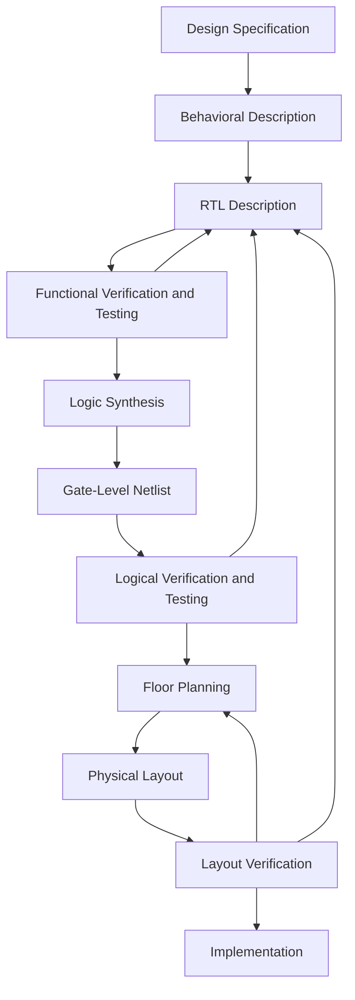

## Chapter 1
# Overview of Digital Design with Verilog HDL

## 1.1 Evolution of Computer-Aided Digital Design

- **Integrated Circuits (ICs)** were invented when logic gates were placed on a single chip.
  - **Small-Scale Integration (SSI)** — very small gate count.
  - **Medium-Scale Integration (MSI)** — hundreds of gates on a chip.
  - **Large-Scale Integration (LSI)** — thousands of gates on a single chip.

- **VLSI (Very Large-Scale Integration)** technology — a single chip with more than **100,000 transistors**.
  - **Computer-aided design (CAD)** techniques became critical for the verification and design of VLSI digital circuits.
  - Computer programs can perform:
    - **Automatic placement** of elements
    - **Routing** of circuit layouts
  - Building **gate-level digital circuits** and then deriving higher-level blocks from them.

- **Logic simulators** came into existence to verify the functionality of circuits.

---

## 1.2 Emergence of HDLs

- **Programming Languages** — sequential execution.
  - FORTRAN
  - Pascal
  - C

- Standard languages to describe digital circuits — **Hardware Description Languages (HDLs)**.
  - They allowed designers to model the **concurrency** of processes found in hardware elements.
  - Examples:
    - **Verilog HDL**
    - **VHDL**

- **Verilog HDL** was developed in **1983** at Gateway Design Automation.

- HDLs were popular for **logic verification**, but designers had to manually translate the HDL-based design into schematic circuits with interconnections between gates.

- In the late 1980s, digital circuits could be described at the **Register Transfer Level (RTL)** using an HDL.
  - The designer had to specify how data flows between registers and how the design processes the data.

- **Logic synthesis tools** would implement the specified functionality in terms of gates and gate interconnections.

- **Common Approach** — Design each IC chip using an HDL, and then verify system functionality through simulation.

---

## 1.3 Typical Design Flow

- This design flow is typically used by designers who use HDLs.

1. **Design Specification** - It abstractly describe the functionality,interface and overall architecture of digital circuit.'

2. **Behavioral Description** - It is created to analyze the design in terms of functionality, performance, compliance to standards and other high level issues.
    - It can be written with HDLs.

3. Behavioural description is manually converted to an **RTL Description**.

4. Logic Synthesis tools convert RTL description to a **gate-level netlist**.

5. The gate level netlist is input to an automatic place and route tool,which creates a layput. The layoutis verfied and then fabricated on chip.

---
## 1.4 Importance of HDLs

- Designer can write their RTL description without choosing a specific fabrication technology. 

- Logic Synthesis tools can automatically convert the design to any farication technology.

- By descriing design in HDls functional verification of design can be done early in the design cycle. (Most design bugs are eliminated at this point).

- Designing with HDLs is analogous to computer programming.

---

## 1.5 Popularity of Verilog HDL

Verilog HDL has evolved as a standard harware description language.
- Easier to use and learn. similar to C programming language.

- It has different levels of abstraction to be mixed in the same model.
    - A designer can define a harware model in terms of 
        - switches
        - gates
        - RTL
        - Behavioral code
- Most logic synthesis tools support Verilog HDL.

- It allows the widest choice of vendors.

- Programming Language Interface (PLI) is a powerful feature that allows the user to write custom C code to interact with the internal Data Structure of Verilog.

---

## 1.6 Trends in HDLs

- The most popular current trend is designing in HDL at the RTL Level, because logic synthesis tools can automatically create gate-level netlists from RTL descriptions.

- Formal Verification: Applies formal mathematical techniques to verify the correctness of Verilog HDL descriptions.

- For very high-speed and timing-critical circuits (like microprocessors), the gate-level netlist generated by logic synthesis tools is often not optimal. Consequently, designers frequently mix gate-level descriptions directly into the RTL description to achieve optimal results.
---