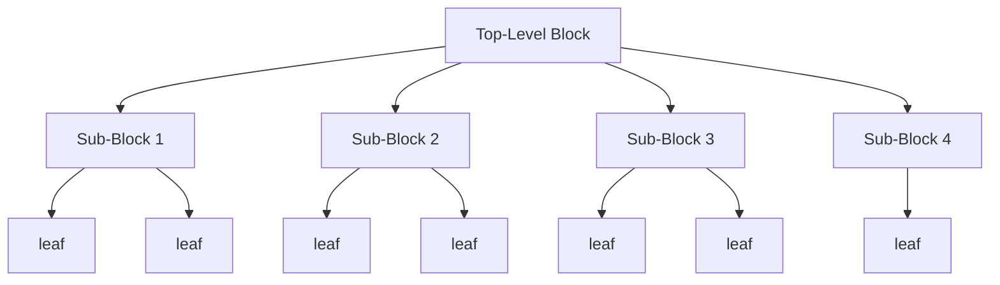
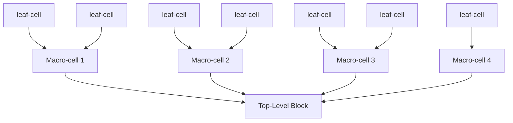
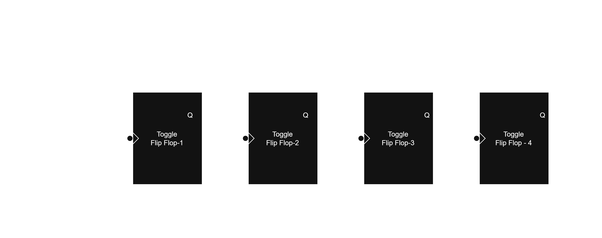
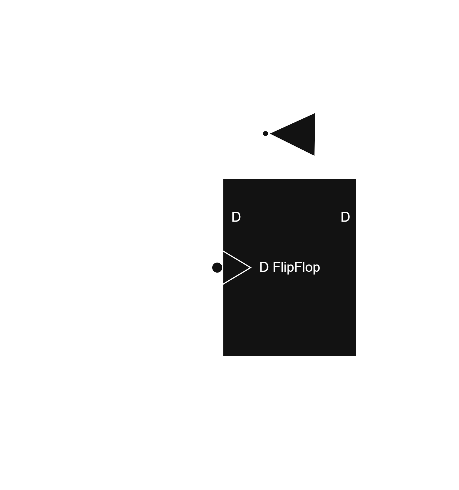
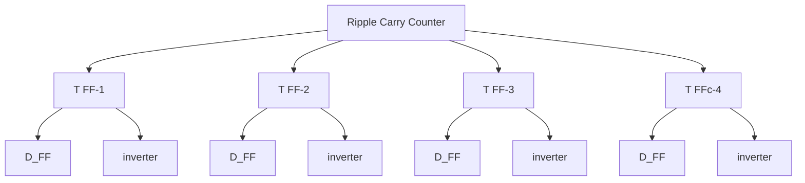

## Chapter 2
# Hierarchical Modeling Concepts

## 2.1 Design Methodologies

- There are two basic tyoes of digital design methodologies
    - **Top-Down** Design Methodology
    - **Bottom-Up** Design Methodology

### <u>Top-down Design Methodology</u>

- In Top-Down we define a Top-level block and further subdivide the block until we come to leaf cells.

---

### <u>Bottom-up Design Methodology</u>

- In Bottom-up design methodology we identify the building blocks and then build bigger cells using these building blocks.

---

- Typically a combination of top-down and bottom-up flows is used.

## 2.2 4 - bit Ripple Carry Counter

### <u>Ripple Carry Counter</u>

- It is made of negative edge triggered toggle flip flops.
- Each Toggle Flip Flops can be made up from D-Flipflops.

### <u>T-flipflop</u>

### <u>Design Hierarchy</u>

---